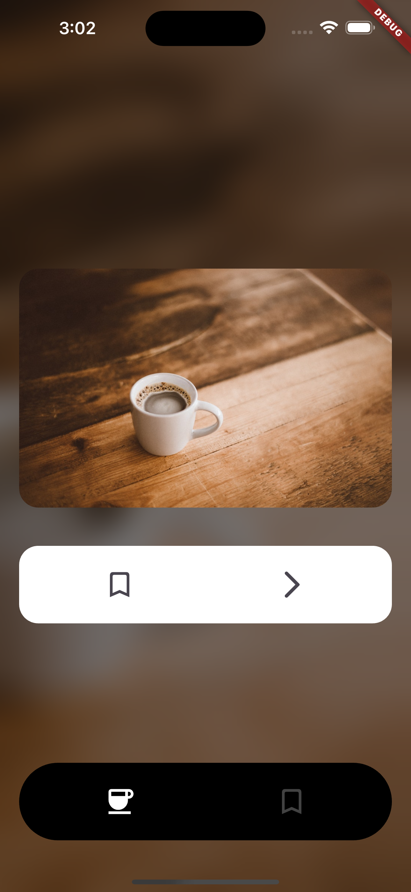
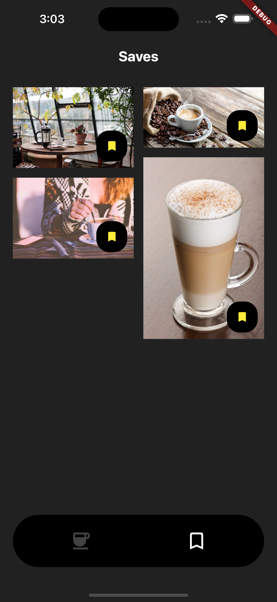

# Flutter Favorite Coffee

A Flutter app that demonstrates how to build a simple app using the [Coffee API][coffee_link].

![coverage][coverage_badge]

---

## Requirements

```
Flutter 3.22.3
```

## Instalación

1. Install Flutter following the instructions in the official documentation: [Documentation][install_flutter].
2. Clone this repository::

```
git clone https://github.com/carrizomiguel/flutter_favorite_coffee.git
```

3. Navigate to the project folder:

```
cd flutter_favorite_coffee
```

4. Install the dependencies:

```
flutter pub get
```

## Getting Started 🚀

```
flutter run
```

## Running Tests 🧪

To run all unit and widget tests use the following command:

```sh
$ flutter test --coverage --test-randomize-ordering-seed random
```

To view the generated coverage report you can use [lcov](https://github.com/linux-test-project/lcov).

```sh
# Generate Coverage Report
$ genhtml coverage/lcov.info -o coverage/

# Open Coverage Report
$ open coverage/index.html
```

---

## Screenshots

 

## Arquitecture

### Project Folder Structure
```
├── lib/
|   ├── app/
│   │   ├── view/
│   │   └── app.dart
│   ├── features/
│   │   ├── feature1/
│   │   │   ├── bloc/
│   │   │   ├── view/
│   │   │   ├── widgets/
│   │   │   └── feature1.dart
│   │   └── feature2/
│   │       ├── bloc/
│   │       ├── view/
│   │       ├── widgets/
│   │       └── feature2.dart
|   ├── bootstrap.dart
│   └── main.dart
├── packages/
|   ├── package1/
│   └── package2/
├── pubspec.yaml
└── README.md
```

[coffee_link]: https://coffee.alexflipnote.dev
[install_flutter]: https://flutter.dev/docs/get-started/install
[coverage_badge]: coverage_badge.svg